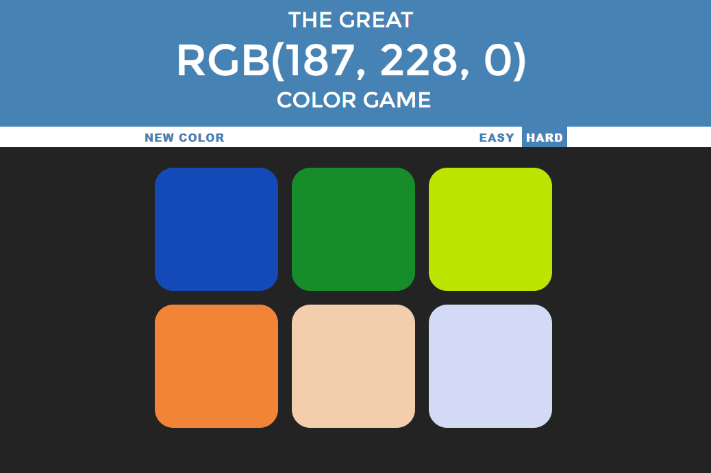

# Colorgame1011 💻
* Simple and interactive HTML,CSS,JS website.
* Example : A random Red Blue Green (x, y, z) shows up along with 6 colors that are also generated randomly. One out of these 6 colors is the correct color that matches the random RGB code. Choose the color you think is closest to the generated RGB code. There is an easy mode and a hard mode. You can generate random RGB code at any point of time in the game by clicking the Play Again button.

## Built with
- HTML5
- CSS3
- JavaScript

### Play Online : [Color Guessing Game]( https://colorgame1011.vercel.app/)

## Made By
[Shaheryar Shaikh](https://github.com/shaheryarshaikh1011)

